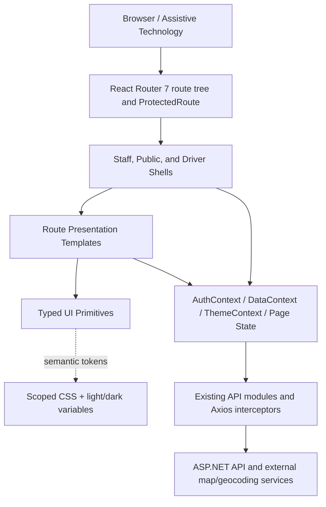

# Technical Design: Frontend UI/UX Migration

**Spec:** `frontend-ui-ux-migration`  
**Workflow:** Requirements-first  
**Scope:** Presentation-layer migration only  
**Source UI revision:** `a4305544058333285bfe6517b258db10e246a1c8`

## Overview

This design migrates the current logistics frontend toward the source UI's visual language while retaining the current application as the sole functional authority. It introduces a scoped semantic-token layer, typed presentation primitives, accessible shell behavior, and route templates in reversible slices. It does not change routes, roles, API contracts, context ownership, calculations, validation rules, workflow transitions, or backend behavior.

The implementation remains on React 19.2, TypeScript 5.9, Vite 8, React Router 7, Axios, the existing `ThemeProvider`, Auth/Data contexts, Lucide, Recharts, Leaflet, QR libraries, and Sonner. No Tailwind, shadcn, Radix, Tabler, or other runtime dependency is introduced. Inter is the only approved typeface; it is self-hosted only if approved font files are added, otherwise the CSS uses `Inter, ui-sans-serif, system-ui, -apple-system, BlinkMacSystemFont, "Segoe UI", sans-serif` without a network font request.

### Approved Decisions

| Decision | Design resolution |
|---|---|
| Typography | Inter only; local assets are optional and separately approved |
| CSS | Existing CSS, deliberately scoped, with semantic CSS variables |
| Navigation | Preserve current role links and collapse behavior; no pinned/favorites feature |
| Dependencies | No new dependency without individual approval and exact version |
| Palette | Extend current teal/navy identity with semantic surface depth |
| Dense mobile tables | Bounded horizontal scroll by default; compact rows require route approval |
| Toasts | Sonner is the only production toast system; source `ToastContext` is excluded |

### Goals and Non-Goals

Goals are visual consistency, mobile-first operability, WCAG 2.2 AA, explicit loading/error/empty feedback, state continuity during refactoring, and measurable route/role/API parity. Non-goals are backend or schema changes, workflow redesign, source demo-state adoption, new navigation behavior, and dependency/platform replacement.

### Research Findings

- React preserves state when the same component type remains at the same tree position; changing parent/component identity can reset descendants. Components must therefore be declared at module scope and migration wrappers must remain structurally stable. [React: Preserving and Resetting State](https://react.dev/learn/preserving-and-resetting-state)
- Keys define identity during reordering. Domain IDs (`order.id`, `notification.id`, `employee.id`, stable status/event IDs) replace positional keys wherever item-local state could exist. [React: Rendering Lists](https://react.dev/learn/rendering-lists)
- Controlled inputs require a stable `value`/`checked`, synchronous `onChange`, and unchanged state owner. Styling wrappers cannot switch controlled inputs to uncontrolled or clear state on failure. [React input reference](https://react.dev/reference/react-dom/components/input)
- WCAG 2.2 requires perceivable status, keyboard operation, visible/unobscured focus, target sizing, contrast, and reflow. These are release gates rather than post-migration polish. [WCAG 2.2](https://www.w3.org/TR/WCAG22/)
- Repository inspection confirms provider order `AuthProvider → DataProvider → ThemeProvider → Router`, a 30-second primary Axios timeout, one-refresh retry behavior, 10-second authenticated data polling, 5-second live-location polling, and partial refresh via `Promise.allSettled`; templates must not absorb these responsibilities.
## Architecture

### Layered, Presentation-Only Architecture



The dependency rule is one-way: shells, templates, and primitives may receive domain data and callbacks, but primitives never import API modules and templates never own production fetching, calculations, permissions, legal status transitions, polling, or persistence. Existing pages remain controller/composition boundaries until a later, separately approved extraction.

### Runtime Boundaries

1. **Application boundary:** `main.tsx`, provider order, `App.tsx`, `ProtectedRoute`, route paths, aliases, redirects, and role lists remain unchanged.
2. **Domain boundary:** `types.ts`, API payload/response mapping, status rules, filters, chart calculations, and context operations remain authoritative.
3. **Presentation boundary:** semantic tokens, scoped selectors, primitives, shells, and templates may change appearance and accessible interaction mechanics only.
4. **Integration boundary:** Recharts, Leaflet/react-leaflet, QR scanner/generator, Lucide, and Sonner remain behind their current callers; migration adapters style their containers without changing data or lifecycle.
5. **Compatibility boundary:** old and new primitives may coexist per slice. A legacy component is removed only after caller inventory, parity tests, and rollback evidence are complete.

### CSS and Theme Architecture

Tokens are defined in the existing global stylesheet under `:root` and `html.dark`, with temporary aliases for current names. Migrated component selectors use a `ui-` prefix or component-owned root namespace (for example, `.ui-button`, `.staff-shell__drawer`) so they cannot style unmigrated markup accidentally. Page CSS may consume tokens but may not redefine semantic meanings.

Token groups are: `--color-brand-*`, `--color-bg-*`, `--color-surface-*`, `--color-text-*`, `--color-border-*`, `--color-focus-*`, `--color-status-*`, `--color-chart-*`, `--space-*`, `--size-*`, `--radius-*`, `--shadow-*`, `--duration-*`, and `--ease-*`. Foreground/on-color pairs are explicit. Light and dark values are contrast-tested in context; statuses always include visible text and, where useful, an icon/pattern.

`ThemeProvider` remains the owner of `light | dark | system` and `app-theme` persistence. Token application follows the provider's existing `html.light`/`html.dark` classes. System media-query changes continue to update the resolved class. No migrated component writes theme state directly.

The default app surface removes ornamental gradients, excessive glass effects, and hover-lift from routine operational content. Depth comes from background/surface steps, restrained borders, and sparse elevation. Cards are reserved for grouped metrics, actions, or bounded content; plain sections/dividers are preferred elsewhere.
### Responsive Architecture

Styles are mobile-first. Base rules support 320px and are enhanced with `@media (min-width: 640px)`, `768px`, `1024px`, `1280px`, and `1536px`. These bands are CSS constants documented once; no Tailwind emulation or page-specific breakpoint drift is permitted.

| Width | Shell and navigation | Content, forms, and overlays | Dense data and media |
|---:|---|---|---|
| 320 (base) | Staff drawer closed; driver bottom nav retained; single-column header actions | 16px minimum gutters, stacked fields/actions, full-width modal sheet with safe margins, 44×44 targets | Bounded table scroll with labelled region; charts/maps use a minimum usable height and non-overlapping controls |
| 640 (`sm`) | Drawer still modal; compact header may place search on second row | Two-column fields only where labels and errors remain readable | Table remains scrollable; selected summaries may form two columns |
| 768 (`md`) | Drawer still modal through 1023px | Dialogs may center; forms use 2-column groups when logical; action rows may inline | Charts can share rows; required table actions stay visible within scroll region |
| 1024 (`lg`) | Persistent staff sidebar; collapse reserves content width and never overlays route content | Page header actions inline when space permits | Tables fill workspace; chart grids use 2 columns where source data supports it |
| 1280 (`xl`) | Expanded workspace and stable navigation rail | Content max-width applied only to reading/forms, not operational tables | Dashboard/report grids may increase density without new data |
| 1536 (`2xl`) | Same information architecture; whitespace increases, not control count | Long forms remain line-length bounded | Multi-panel analytics may use available width; no stretched unreadable plots |

At every width the page root must have `scrollWidth <= clientWidth`; only explicit `.ui-scroll-region` containers may overflow horizontally. Scroll regions receive a visible or programmatic label, keyboard focus when necessary, edge affordance, and retained actions. At 200% zoom, the same base reflow rules apply.

### Shell and Focus Model

The staff shell owns only `drawerOpen` and desktop `collapsed` presentation state. Below `lg`, opening the drawer records the invoker, locks background scroll, marks/inerts non-drawer content where supported, moves focus to the first meaningful drawer control, traps Tab/Shift+Tab, and supports Escape/backdrop/close-button dismissal. Close restores focus to the invoker if still connected. Route selection also closes the mobile drawer. At `lg`, the sidebar is non-modal and never traps focus.

The driver shell retains its current header, back behavior, outlet, and bottom navigation. Presentation changes reserve bottom safe-area space so route content and focused controls are not obscured. Public/auth shells remain independent of staff navigation.

Modal uses the same overlay contract: labelled `role="dialog"`, `aria-modal`, initial focus, focus containment, Escape according to operation safety, background isolation, internal overflow, body-scroll restoration, and invoker restoration. Destructive operations cannot close while submitting unless the current workflow allows cancellation.

### React State-Integrity Rules

- Stateful components are declared outside render and remain the same type at the same tree position across visual variants.
- Responsive behavior is CSS-first; do not conditionally swap stateful desktop/mobile component types merely because viewport width changes.
- Lists use stable domain keys. Index keys are allowed only for immutable, non-interactive decorative series with no domain identifier.
- A migration wrapper forwards the original controlled `value`/`checked`, `onChange`, `name`, `id`, validation attributes, submit handler, and ref. State remains in the existing page/context.
- Route templates remain presentational: data and callbacks enter through typed props; no API/context imports unless the existing page itself remains the template owner during transition.
- Intentional reset requires an explicit domain key and a test documenting the existing reset behavior.
### Migration Slice Architecture

Each slice is independently releasable and reversible:

| Slice | Boundary | Allowed change | Exit/rollback boundary |
|---|---|---|---|
| 1. Foundations | token file, typography, focus/reduced-motion base rules | aliases plus semantic variables; no caller changes | remove new imports/selectors; aliases keep legacy CSS valid |
| 2. Shells | staff/public/driver layout CSS and accessibility mechanics | drawer/focus behavior and presentation | revert shell component/CSS pair; route tree untouched |
| 3. Primitives | button, badge, card, state, table, field, dropdown, modal, toast adapter | typed presentation contracts | keep legacy export or compatibility wrapper until all callers pass |
| 4. Shared compositions | header, search, filters, notifications, chart/map containers | presentation and accessible interaction only | revert composition while primitives remain additive |
| 5. Route cohorts | dashboard → lists → details/forms → reports/auth/public → driver | page markup/CSS and primitive adoption | revert one route cohort without changing API/context/domain files |
| 6. Cleanup | duplicate CSS/components and aliases | remove only zero-caller legacy assets | restore from prior release; never combine cleanup with behavior change |

A slice manifest records affected routes, roles, components/files, API operations observed, visual baselines, accessibility checks, compatibility adapters, and rollback commit/tag. Feature flags are not required because boundaries are file/component based; if deployment risk demands a runtime switch, approval is required before adding configuration.

## Components and Interfaces

### Primitive Contracts

Contracts below are design targets. Existing public props remain supported through wrappers until caller migration is complete.

```ts
type Tone = 'neutral' | 'brand' | 'success' | 'warning' | 'danger' | 'info';
type Size = 'sm' | 'md' | 'lg';

interface ButtonProps extends React.ButtonHTMLAttributes<HTMLButtonElement> {
  variant: 'primary' | 'secondary' | 'outline' | 'ghost' | 'danger';
  size?: Size; loading?: boolean; iconOnlyLabel?: string;
}

interface StatusBadgeProps {
  status: DeliveryStatus | AccountStatus | POTStatus | PODStatus | NotificationType;
  size?: 'sm' | 'md';
}

interface FeedbackStateProps {
  kind: 'loading' | 'empty' | 'error';
  title: string; description?: string; action?: React.ReactNode;
  announce?: 'polite' | 'assertive' | 'off';
}
```

`Button` enforces an accessible name for icon-only use and exposes native disabled semantics while loading. `StatusBadge` uses an exhaustive canonical status-to-tone/icon/label map; unknown production status is rendered as neutral text and reported in development rather than inferred by substring. `FeedbackState` provides explicit copy for operational surfaces and never fabricates records or success.
```ts
interface ColumnDef<T> {
  id: string;
  header: React.ReactNode;
  cell: (row: T) => React.ReactNode;
  headerLabel?: string;
  className?: string;
}

interface DataTableProps<T> {
  rows: readonly T[];
  columns: readonly ColumnDef<T>[];
  getRowKey: (row: T) => React.Key;
  caption: string;
  onRowActivate?: (row: T) => void;
  empty: { title: string; description?: string };
  busy?: boolean;
}

interface ModalProps {
  open: boolean; onOpenChange: (open: boolean) => void;
  title: string; description?: string;
  initialFocusRef?: React.RefObject<HTMLElement | null>;
  restoreFocusRef?: React.RefObject<HTMLElement | null>;
  closeOnEscape?: boolean; submitting?: boolean;
  children: React.ReactNode; footer?: React.ReactNode;
}
```

`DataTable` emits native table semantics, a caption (visually hidden when appropriate), scoped column headers, stable row keys, and a bounded scroll wrapper. Row activation never makes nested controls ambiguous: keyboard row navigation is added only when the row has a single destination; otherwise a named link/action is used. Existing search, sort, pagination, selection, exports, and permissions stay in page owners.

`Modal` centralizes focus mechanics but not open state or transaction state. The owner supplies callbacks and loading status. A destructive confirm receives distinct cancel/confirm labels and preserves existing operation order.

```ts
interface FieldShellProps {
  id: string; label: string; required?: boolean;
  hint?: string; error?: string;
  children: React.ReactElement;
}

interface PageHeaderProps {
  title: string; eyebrow?: string; description?: string;
  backAction?: { label: string; onActivate: () => void };
  actions?: React.ReactNode;
}

interface ToastEvent {
  idempotencyKey: string;
  type: 'success' | 'error' | 'info' | 'warning';
  message: string;
}
```

`FieldShell` binds label/hint/error IDs and sets `aria-invalid`/`aria-describedby` through child composition without changing the input's value or handler. `PageHeader` uses utility copy and one clear action hierarchy. Toast calls remain direct Sonner calls or pass through a thin non-stateful adapter; `idempotencyKey` prevents duplicate presentation from one action, and no `ToastContext` is introduced.

### Compositions and Templates

- **StaffShell:** current outlet, role-filtered `Sidebar` links, search, notifications, profile/logout, drawer and collapse state.
- **DriverShell:** current outlet, header/back action, notifications, bottom navigation, safe-area spacing; QR/GPS workflow ownership remains in current pages/hooks.
- **PublicShell/AuthShell:** tokenized brand framing without staff navigation or private data.
- **DataPageTemplate:** page heading, query controls, feedback state, table/collection region, pagination/actions; all supplied by props.
- **DetailPageTemplate:** heading, status, metadata sections, timeline/map/proof/action slots; no status rules.
- **FormPageTemplate:** grouped field slots, validation summary, submit/cancel slots; no field state, validation, or payload construction.
- **AnalyticsTemplate:** metric, filter, chart, table, drill-down, and export slots; preserves current Recharts data and handlers.
### Specialized Presentation

**Search/dropdowns:** Search remains controlled by its current owner. Results use a labelled list/popover, clear empty state, Escape dismissal, outside-pointer dismissal, logical keyboard order, and focus restoration without replacing current matching or navigation. Dropdown triggers expose expanded state and popup relationship.

**Notifications:** Header, staff page, and driver page consume existing DataContext records and operations. Presentation waits for confirmed outcomes before success feedback. Because current context mutation methods are typed as `void` while internally asynchronous, migration must first preserve behavior with a compatibility adapter that returns an explicit result without changing endpoint/order; UI cannot optimistically claim success. A failed action retains/restores the last confirmed list and produces one Sonner error plus contextual text where needed.

**Charts:** Existing Recharts series, labels, values, legends, filters, tooltips, drill-down and exports are passed unchanged. Containers provide a visible title, textual summary/table alternative for essential values, tokenized series colors, non-color distinctions where feasible, responsive minimum dimensions, and no clipped controls. Decorative animation is disabled under reduced motion.

**Maps:** Existing Leaflet markers, coordinates, permission/polling/cleanup behavior, and privacy rules remain unchanged. The wrapper provides a title, connection/status text, last-update text, keyboard-accessible external/text alternative where required, stable height, and bounded overflow. The map is not the sole source of delivery status/location meaning.

**QR and proof workflows:** Scanner/generator/upload libraries and current validation stay in their pages. Presentation preserves camera permission feedback, alternate lookup/recovery, file type/5 MB limit, preview, recipient/proof fields, progress, and outcome semantics.

### Accessibility Mechanics

- One `main` landmark per shell; named navigation landmarks; hierarchical route headings; table captions/headers; native controls first.
- `:focus-visible` uses a semantic high-contrast ring with offset and is never clipped by overflow. Sticky/fixed chrome leaves the focused target unobscured.
- Normal text contrast is at least 4.5:1; large text and meaningful non-text boundaries/focus are at least 3:1 in both themes.
- Base/sm interactive targets are at least 44×44 CSS px, or spacing provides the equivalent target-separation exception only when documented.
- Loading and routine completion use polite live regions; blocking errors use assertive announcements sparingly. Toast announcements are not duplicated by a second live region with identical text.
- Validation provides a summary linked to fields and moves focus to the first invalid field. Error text remains adjacent and associated.
- Reduced motion removes background gradients, shimmer translation, entrance motion, and non-essential transforms; state changes remain visible instantly.
- Color, icon, position, and motion are supplementary. Status/outcome always includes text.

### Route, Role, and API Parity Matrix

| Cohort | Routes/roles | Presentation target | Parity evidence |
|---|---|---|---|
| Public/auth | `/login`, `/account-locked`, `/tracking`; unauthenticated/public | Auth/Public shell, fields, tracking timeline/map | session outcomes, privacy, lookup/re-delivery requests, request/response snapshots |
| Staff core | dashboard, orders/detail/history/edit, track/search, archive, failed pickups, notifications, tasks, dispatch, activity logs; ADMIN/OP. TEAM/CLIENT as configured | Staff shell plus data/detail/form templates | route guard matrix, role-visible links/actions, CRUD/status/assignment/archive/notification requests |
| Admin | reports, summary, analytics, settings, employees, role access, design system; ADMIN | analytics/data/form templates | authorization, calculations, chart/filter/drill-down/export, employee/settings operations |
| Driver | all `/driver/*`; DRIVER | retained Driver shell plus style-only primitives | bottom nav/back, QR, GPS, status sequence, POD/POT/pickup/failure requests and cleanup |
| Redirects | `/`, `/POT-records`, `*` | no visual behavior change | destination by auth/role and replace semantics |

For every migrated transaction, capture method, normalized URL, headers relevant to behavior, payload, response status, and visible outcome before and after. Tokens and volatile timestamps are redacted; zero unintended differences are accepted.
## Data Models

No backend schema or production domain model changes are required. `Employee`, `DeliveryOrder`, `Notification`, `ActivityLog`, `DeliveryStatus`, role, POD/POT, and related API DTOs remain authoritative. New models are presentation-only and should live beside the design-system layer rather than in domain/API modules.

```ts
interface SemanticStatusPresentation {
  label: string;
  tone: 'neutral' | 'brand' | 'success' | 'warning' | 'danger' | 'info';
  icon?: LucideIcon;
  assistiveText?: string;
}

type StatusPresentationMap = {
  [S in DeliveryStatus | AccountStatus | POTStatus | PODStatus]: SemanticStatusPresentation;
};

interface AsyncViewState<T> {
  status: 'idle' | 'loading' | 'success' | 'empty' | 'error';
  confirmedData?: T;
  errorMessage?: string;
  retry?: () => void;
}

interface MigrationSliceManifest {
  id: string;
  routes: string[];
  roles: UserRole[] | ['PUBLIC'];
  changedFiles: string[];
  operations: ApiParityRecord[];
  checks: ValidationRecord[];
  compatibilityAdapters: string[];
  rollbackBoundary: string;
}
```

`StatusPresentationMap` must be exhaustive for canonical statuses so presentation cannot silently reinterpret domain strings. `AsyncViewState` is a view representation derived from current owner state; it is not a replacement context and does not initiate I/O. It preserves `confirmedData` during recoverable refresh failures when current behavior does.

```ts
interface ApiParityRecord {
  operation: string;
  method: string;
  normalizedPath: string;
  requestShapeHash: string;
  responseStatus: number;
  observableOutcome: string;
  matchesBaseline: boolean;
}

interface ValidationRecord {
  requirementIds: string[];
  route: string;
  role: UserRole | 'PUBLIC' | 'UNAUTHENTICATED';
  viewport: 320 | 640 | 768 | 1024 | 1280 | 1536;
  theme: 'light' | 'dark' | 'system';
  checks: string[];
  result: 'pass' | 'fail' | 'blocked';
  evidence: string;
}
```

Evidence records are test/release artifacts, not runtime application data. They provide requirement-to-file-to-check traceability and make rollback decisions objective.

### Data Flow Invariants

1. Existing contexts/pages fetch and mutate data; templates receive snapshots and callbacks.
2. Domain mapping occurs exactly where it does today unless a separately tested pure adapter is extracted without changing output.
3. Presentation never manufactures a record, metric, coordinate, status, count, timestamp, or successful outcome.
4. The status map changes only visual metadata; it cannot authorize a transition.
5. A failed mutation retains the last confirmed state; user-entered form state stays with its existing owner.
6. All collection identity uses domain keys through sorting, filtering, pagination, and responsive presentation.
## Correctness Properties

*A property is a characteristic or behavior that should hold true across all valid executions of a system-essentially, a formal statement about what the system should do. Properties serve as the bridge between human-readable specifications and machine-verifiable correctness guarantees.*

### Redundancy Reflection

The prework identified related properties for no fabricated data, KPI projection, and chart projection; these are consolidated into one presentation-fidelity property because exact projection subsumes separate count/value assertions. Component identity and reordering remain one state-association property. Controlled-input, form-payload, and failure-retention checks are consolidated because they share one owner-state invariant. Notification success and failure are combined into one confirmed-state transition property, while toast cardinality remains separate because it validates feedback, not data state. The remaining properties validate distinct failure modes.

### Property 1: Presentation Projection Fidelity

For all valid production view models—including record lists, KPIs, and chart series—the migrated presentation projection contains the same domain identities, labels, values, ordering where meaningful, and cardinality as its input or an explicitly selected subset, and contains no record, metric, status, or value not derived from that input.

**Validates: Requirements 1.4, 5.1, 5.2**

### Property 2: State Follows Stable Identity

For all stateful component models, valid local states, cosmetic presentation variants, and permutations of uniquely identified items, rerendering without an intentional reset preserves component state, and reordering keeps each item-local state associated with the same domain identifier.

**Validates: Requirements 4.1, 4.2**

### Property 3: Controlled Form Contract Equivalence

For all valid controlled form states and user change sequences, the migrated field/form wrappers report the same changes to the same owner, apply validation at the same time, submit the same payload in the same callback order, and preserve recoverable field values when submission rejects unless the baseline explicitly resets or rolls them back.

**Validates: Requirements 4.3, 4.5, 6.1**

### Property 4: Presentation Control Transition Equivalence

For all valid initial states and event sequences for a modal, drawer, filter, pager, or dropdown, the migrated presentation produces the same owner-state transitions and callback arguments as the baseline contract, excluding additional accessibility-only metadata that does not change domain results.

**Validates: Requirements 4.4**

### Property 5: Canonical Status Mapping Is Total and Deterministic

For all canonical delivery, account, POD, and POT statuses, status presentation returns exactly one stable text label and semantic tone plus a non-color-readable representation, and repeated mapping of the same status returns an equivalent result without substring inference.

**Validates: Requirements 5.7**

### Property 6: Notification State Changes Only on Confirmed Outcomes

For all confirmed notification lists, selected notification IDs, and read/delete/clear operations, a successful confirmed result changes only the records required by that operation, while a rejected result leaves or restores a state deeply equivalent to the last confirmed list and identifies the failed operation.

**Validates: Requirements 8.2, 8.3**

### Property 7: Feedback Is At-Most-Once Per Action

For all user action identifiers and any sequence of pending, success, retry, and failure completions, the feedback adapter emits no more than one Sonner toast for that action identifier while permitting associated field-level feedback.

**Validates: Requirements 8.5**
## Error Handling

The migration does not redefine domain errors. It presents existing failures consistently and preserves last confirmed/user-owned state.

| Failure class | Presentation behavior | State/operation rule | Announcement |
|---|---|---|---|
| Initial route load | In-context loading state sized to avoid disruptive layout shift | Existing request/poll owner remains active | Polite status if loading is perceptible |
| Empty valid result | Subject-specific empty title, filter/query context, clear/reset action when available | Empty array remains authoritative; no sample rows | Normal readable content |
| Recoverable fetch failure | Error state with plain-language retry; stale confirmed data may remain if current owner preserves it | Retry invokes existing callback; no new request path | Assertive only when blocking |
| Client validation | Field message and summary; focus first invalid field | Block submit; retain all other values | Summary announced once |
| Server validation/rejection | Safe actionable message; field mapping only when current contract supports it | Retain recoverable state; no false success | One error toast or inline announcement, not both with duplicate text |
| Unauthorized/session expiry | Existing redirect, cleanup, and one-refresh behavior | Do not intercept or reinterpret in templates | Destination page communicates state |
| Notification mutation failure | Identify failed action and retain/restore confirmed list | Adapter must await current async operation outcome before success | One Sonner error; contextual status as needed |
| Partial refresh failure | Keep independently fulfilled collections and expose unavailable section state | Preserve existing `Promise.allSettled` semantics | Announce only affected visible section |
| GPS/map/QR permission or connection failure | Existing recovery action plus textual state; map/visual is not sole signal | Existing hooks, polling, and cleanup remain owner | Polite reconnecting; assertive only for blocked task |
| Export/upload failure | Actionable retry/correction; preserve form/selection where safe | Existing API/file validation and operation order remain | One final outcome message |

Unexpected render failures continue through the existing `ErrorBoundary`. Primitives must not swallow callback exceptions or convert rejected operations into success. Internal details, tokens, payload secrets, and stack traces are logged only through current development/error paths and are not exposed in UI copy.

### Focus and Error Recovery

On validation failure, focus moves to the first invalid control after errors render. On modal/drawer dismissal, focus returns to the invoking control if connected; otherwise it moves to the nearest logical route heading or next safe action. If success removes a table row that invoked a modal, focus moves to the table heading/next row according to documented slice behavior. Scroll positioning uses `scrollIntoView({ block: 'nearest' })` with reduced-motion-safe behavior.

### Compatibility and Rollback Strategy

- Add semantic tokens and new primitives before replacing callers; maintain aliases and wrapper exports.
- Do not modify API/domain files merely to ease styling. If an adapter needs an operation result (notably notifications), wrap the existing operation at the presentation boundary or separately approve a backward-compatible return-type correction with endpoint parity tests.
- Never mix contract removal with route migration in the same slice.
- Capture visual and API parity baselines before each route cohort. A failed gate reverts only that cohort's component/CSS changes.
- Preserve legacy selectors until repository search confirms zero callers; remove aliases only in cleanup.
- Package manifest and lockfile changes are prohibited in this design. Inter assets, if later approved, are additive local files with fallback-chain validation; absence of assets is not an error.
- Rollback restores previous component/CSS imports and compatibility export. Provider order, route definitions, contexts, and API modules stay untouched, limiting rollback blast radius.

### Risk Controls

| Risk | Control and stop condition |
|---|---|
| CSS leakage | Namespace selectors; compare migrated and unmigrated routes; stop on unintended computed-style change |
| State reset | Stable tree/type/key tests; stop on lost input, selection, expansion, or modal state |
| API drift | Request/outcome parity record; stop on any unintended method/path/header/payload/status difference |
| Role/route drift | Full role matrix; stop on missing/extra link, action, route, or changed redirect |
| Accessibility regression | Automated plus manual keyboard/AT/zoom checks; stop on any new critical/serious issue |
| Duplicate feedback | Sonner-only import scan and action-id test; stop on duplicate toast/live announcement |
| Responsive overflow | Six-width geometry check; stop on page-level overflow or hidden required action |
| Canonical status mismatch | Exhaustive typed map; stop on unknown/unmapped canonical status |
| Performance regression | Compare route bundle and representative render/load timing; stop on unexplained material regression |
## Testing Strategy

Testing uses complementary layers: pure property tests for universal mapping/state invariants, focused unit/component examples for boundaries and interaction contracts, integration tests for routes/providers/APIs/libraries, and manual-assisted accessibility/visual verification. PBT is appropriate only for the seven pure properties above; it is not used to repeatedly call APIs, render CSS geometry, or test third-party service behavior.

### Test Tooling Gate

The repository currently has build and lint scripts but no committed test runner or PBT library. The selected PBT library is **fast-check** because it is TypeScript-oriented, supports generated structured values and shrinking, and integrates with common JavaScript runners. Adding it—and any test runner/browser tooling—requires separate individual approval with exact pinned versions; no package change is authorized by this design. Do not hand-roll a substitute generator while approval is pending. [fast-check documentation](https://fast-check.dev/docs/introduction/getting-started/)

Content from external documentation is summarized and rephrased for licensing compliance.

### Property Tests

Each correctness property is implemented by exactly one property-based test, with at least 100 successful runs and deterministic seed/replay information on failure. Arbitraries model only valid domain/view states unless the property is specifically about invalid input. A failed run must retain the minimal counterexample.

Every test contains this comment format:

```ts
// Feature: frontend-ui-ux-migration, Property 1: Presentation Projection Fidelity
```

The same format applies sequentially through Property 7. Property tests use pure adapters/reducers or controlled component harnesses with mocked callbacks; they do not make network, timer, geolocation, camera, filesystem, or browser-service calls.

### Unit and Component Tests

Focused examples cover:

- exact token/status examples and unknown-status fallback;
- empty, loading, stale-data, retry, and blocking-error states;
- field label/hint/error association and first-invalid focus;
- POD JPEG/PNG at and below 5 MB, wrong type, and over-limit files;
- modal existing-invoker and removed-invoker focus restoration;
- destructive confirm cancel/confirm/loading paths;
- reduced-motion behavior;
- no-results search and filter context;
- Sonner success/error presentation without duplicate live text;
- compatibility wrappers for each legacy primitive prop contract.

Avoid duplicating broad input coverage already owned by properties. Use examples for browser semantics and explicit boundaries.

### Integration and Parity Tests

1. **Route/role:** every route for PUBLIC/UNAUTHENTICATED and applicable ADMIN, OP. TEAM, CLIENT, DRIVER states; verify links, guards, redirects, outlet, actions, and fallback.
2. **Auth/API:** login, lockout, restore, token header, valid refresh and one retry, failed-refresh cleanup, logout revocation, 30-second timeout, errors, upload/download.
3. **Data:** 10-second authenticated refresh, independent `Promise.allSettled` outcomes, 5-second live-location polling, subscription/timer cleanup, optimistic/local behavior already present.
4. **Workflows:** CRUD, assignment, legal/illegal status transitions, notification actions, archive/restore, exports, QR, GPS/maps, POD/POT, re-delivery, pickup, role access, settings.
5. **API parity:** compare normalized request/outcome records for every migrated transaction; no unintended difference passes.
6. **Third-party presentation:** Recharts/Leaflet/QR/Sonner smoke with current data/callback contracts; do not test library internals.
### Responsive, Theme, and Accessibility Matrix

For every migrated route, run 320, 640, 768, 1024, 1280, and 1536 CSS-pixel viewports in light and dark themes; test system mode persistence and a live OS-preference change once per shell cohort. At each cell verify root overflow, required content/actions, long strings, target size, fixed/sticky overlap, and bounded regions. Forms/modals/charts/maps receive dedicated mobile checks.

Accessibility validation combines automated scanning with manual checks because automation cannot establish full WCAG conformance:

- keyboard-only traversal, logical order, drawer/modal containment and restoration;
- screen-reader smoke for landmarks, headings, names/roles/values, tables, validation, dynamic status, charts/maps alternatives;
- token contrast calculations in both themes and browser review of focus boundaries;
- 200% zoom and 320 CSS-pixel reflow;
- reduced-motion emulation;
- no color-only status/outcome;
- focused targets remain unobscured by headers, bottom navigation, overlays, or virtual-keyboard layout.

### Static and Build Validation

For each slice run the existing non-watch commands `npm run lint` and `npm run build` (which includes `tsc -b` and Vite production build). Static checks also inventory hardcoded colors in migrated component CSS, unscoped selectors, non-Lifecyle-safe listeners/timers, index keys in interactive collections, direct API/context imports in pure templates, non-Lucide icon packages, `ToastContext`, and dependency changes.

A slice advances only when it has zero migration-attributable build/type/lint errors, no failed property/unit/integration checks, no critical/serious accessibility regression, no API/route/role drift, and no page-level overflow at the required matrix. Existing unrelated warnings are recorded, never silently reclassified as migration success.

### Performance and Visual Regression

Capture representative shell/dashboard/list/detail/form/report/driver screenshots before and after at required widths/themes. Review intentional diffs against source-inspired design goals and reject unrelated changes to unmigrated routes. Compare production bundle output and representative route rendering/interaction timing; a material unexplained increase blocks the slice. Font testing covers both approved local Inter assets and the fallback-only path.

## Implementation Sequence

This sequence defines technical dependencies, not `tasks.md` work items:

1. Establish baselines and slice manifests; inventory routes, roles, primitive callers, API operations, and known existing diagnostics.
2. Add scoped semantic tokens, theme pairs, Inter fallback chain, focus-visible, reduced-motion, and compatibility aliases.
3. Migrate staff shell accessibility/responsiveness; verify retained public and driver shells before any page cohort.
4. Introduce primitives in dependency order: button/status/feedback/card → field/dropdown/search → table → modal → toast adapter.
5. Migrate shared header/search/notifications/filters/chart-map containers without moving owner state.
6. Migrate route cohorts: dashboard; lists; details/history/tracking; forms/transactions; reports/analytics/admin; auth/public; driver style-only.
7. Run full route-role-workflow-width-theme-accessibility/API parity gates.
8. Remove only proven zero-caller legacy CSS/components/aliases and publish final traceability/compatibility report.

### Requirement Traceability

| Requirements | Design coverage | Primary validation |
|---|---|---|
| R1, R7 | Runtime boundaries, data-flow invariants, API parity | projection property + workflow/request parity |
| R2 | Responsive architecture, shell/focus model, route matrix | route-role and drawer/desktop integration |
| R3 | CSS/theme architecture, primitive contracts | token/import/static checks and theme matrix |
| R4 | React integrity rules, presentation-only templates | Properties 2–4 and dependency scan |
| R5 | Data table, feedback, charts/maps, status map | Properties 1/5, mobile geometry, chart/table integration |
| R6 | Field/modal contracts, focus/error recovery | Property 3, boundary examples, keyboard integration |
| R8 | Notification composition, toast adapter | Properties 6–7, API and announcement integration |
| R9, R10 | Responsive matrix and accessibility mechanics | six-width/theme/zoom/keyboard/AT/contrast matrix |
| R11 | Slice architecture, compatibility/rollback, risk controls | manifests, dependency diff, promotion gates |
| R12 | All evidence models and test matrices | final traceability and parity report |

## Design Completion Criteria

The design is ready for task planning when requirements reviewers confirm the approved defaults are represented, all route/domain authorities remain outside presentation templates, PBT tooling approval is tracked as a dependency decision rather than silently added, and no unresolved design gap requires changing `requirements.md`. If review identifies a functional or acceptance-criteria gap, return to requirements clarification before creating tasks.
