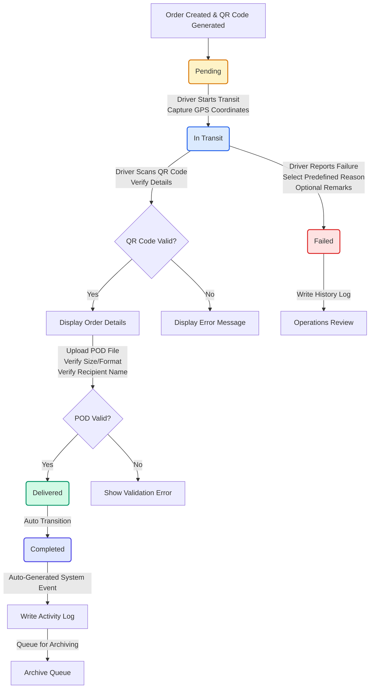
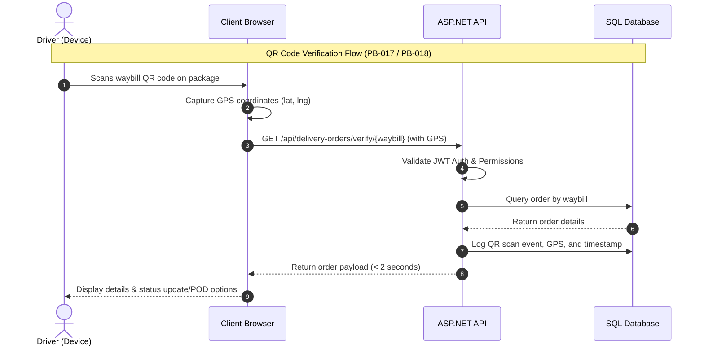
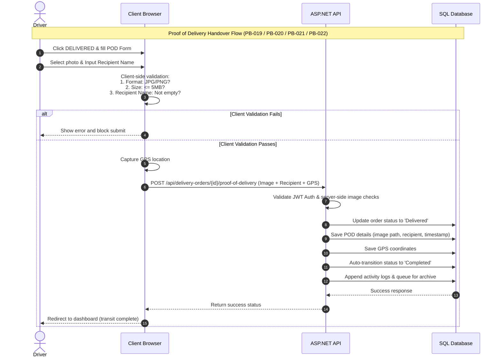

# 🚚 Sprint 3 Test Plan & Test Flow Document

This document defines the comprehensive QA Test Plan, Test Flows, and Test Cases for **Sprint 3** of the Delivery Tracker and Proof of Delivery (POD) Capstone System. 

---

## 📌 1. Document Overview

### 1.1 Purpose
The purpose of this document is to outline the testing strategy, workflows, and detailed test cases to verify the implementation of Sprint 3 features, which focus on:
* **Real-time Delivery Tracking** (Status tracking, map visualizations, and WebSocket live updates)
* **QR Code Package Verification** (Automatic QR generation, scanning, and fast data retrieval)
* **Proof of Delivery (POD) Workflow** (Photo upload, size/format validations, recipient logging, and auto-completion)
* **GPS Location Tagging** (Automatic coordinate logging during status updates and scans)

### 1.2 Target Features (Product Backlog Items)
| PBI ID | Description | Role(s) Involved |
| :--- | :--- | :--- |
| **PB-011** | View current delivery status and tracking history | Ops Admin, Ops Team, Driver, Client |
| **PB-012** | Update live delivery status of assigned shipment | Driver |
| **PB-013** | Log predefined failure reasons and remarks | Driver |
| **PB-014** | Auto-capture GPS coordinates on status updates/scans | Driver, Ops Admin |
| **PB-015** | View complete delivery audit trail (full vs. condensed) | Ops Admin, Ops Team, Client |
| **PB-016** | Auto-generate unique QR codes on order creation | Ops Team, System Admin |
| **PB-017** | Scan waybill QR code to retrieve order details | Driver, Ops Team, Admin |
| **PB-018** | Display tracking summary and action buttons upon QR scan | Driver, Ops Admin, Client |
| **PB-019** | Upload photographic Proof of Delivery (POD) image | Driver, Ops Team |
| **PB-020** | Record recipient name, timestamp, and driver details | Driver, Ops Admin |
| **PB-021** | Auto-transition status to 'Completed' & queue for archiving | System Admin, system |
| **PB-022** | Validate uploaded POD images (size < 5MB, JPG/PNG format) | System Admin, system |

---

## 🔑 2. Roles & Permissions Testing Matrix (RBAC)

To verify JWT validation and access controls, tests must confirm that only authorized personnel can invoke endpoints or view specific details.

| Role | View Order Status | Update status | Log Failure Form | Scan QR Code | Upload POD Image | View Sensitive Logs | View Public Portal |
| :--- | :---: | :---: | :---: | :---: | :---: | :---: | :---: |
| **Super Admin** | Yes | Yes | No | Yes | No | Yes | Yes |
| **Admin** | Yes | Yes | No | Yes | No | Yes | Yes |
| **Ops Team** | Yes | No | No | Yes | No | Yes (No sensitive info) | Yes |
| **Driver** | Yes (Assigned only) | Yes (Assigned only) | Yes (Assigned only) | Yes | Yes (Assigned only) | No | Yes |
| **Client (Public)** | Yes (Waybill only) | No | No | No (No login) | No | No | Yes |

---

## 📊 3. Sprint 3 Core Test Flows

### 3.1 Delivery Order Lifecycle & Status Transitions
This state diagram tracks the allowed transitions of a delivery order and the automated system events triggered.



---

### 3.2 QR Code Scanning & Details Verification Flow
This sequence diagram shows how a device scans a waybill QR code to retrieve tracking information securely and log the scanning event.



---

### 3.3 Proof of Delivery (POD) Validation & Completion Flow
This sequence diagram illustrates the validation workflow for uploading POD images and details, ending with an automated status update to 'Completed' and system logs writing.



---

## 📝 4. Detailed Test Case Specification Matrix

| Test ID | User Story | Test Scenario | Preconditions | Test Steps & Inputs | Expected Result | Pass/Fail |
| :--- | :--- | :--- | :--- | :--- | :--- | :---: |
| **TC-011-01** | PB-011 | View delivery status (Admin/Ops) | User logged in as Admin/Ops; orders exist. | 1. Navigate to order management page.<br>2. Select order `SPX-2026-0841`. | Order detail loads. Current delivery status is clearly highlighted in header. | |
| **TC-011-02** | PB-011 | Order history chronological log | Order has multiple status changes. | 1. Open order detail page.<br>2. Click on the "History" tab. | Status logs display in chronological order with exact timestamps and responsible users. | |
| **TC-011-03** | PB-011 | Client public tracking search | No login required; valid waybill exists. | 1. Open public tracking site.<br>2. Input `SPX-2026-0841` and click Search. | Current status and history timeline show. No sensitive driver name details visible. | |
| **TC-012-01** | PB-012 | Update status to "In Transit" | Driver logged in; order assigned to them. | 1. Access assigned order.<br>2. Click **START TRANSIT**. | Status updates in frontend and DB within 3 seconds. GPS coordinates and driver ID recorded. | |
| **TC-012-02** | PB-012 | Block unauthorized status update | Unauthorized user (e.g. client or different driver) attempts change. | 1. Send API PUT request to `/api/deliveryorders/1` with invalid JWT. | Returns HTTP `401 Unauthorized` or `403 Forbidden`. DB status is unchanged. | |
| **TC-013-01** | PB-013 | Report failed delivery with remarks | Driver logged in; order is "In Transit". | 1. Click **FAILED** button.<br>2. Select reason: `Customer Not Home`.<br>3. Input remarks: `Gate locked`. Click Submit. | Status transitions to `Failed`. Reason, remarks, timestamp, and GPS are saved and visible to Ops. | |
| **TC-013-02** | PB-013 | Submit failed delivery without reason | Failure modal presented to driver. | 1. Deselect/leave reason empty (if choice is available).<br>2. Click **Confirm Failure**. | Submission blocked. Validation error banner: "Please select a reason for failure." | |
| **TC-014-01** | PB-014 | Automatic GPS tag validation | Driver updates status or scans QR; GPS active. | 1. Perform status update on mobile browser. | GPS coordinates (latitude & longitude) captured automatically and saved. | |
| **TC-014-02** | PB-014 | Admin views captured GPS tag | Order updated with GPS; logged in as Admin. | 1. View delivery details of order `SPX-2026-0841`. | Geolocation tags and coordinates display next to the timestamp in history list. | |
| **TC-014-03** | PB-014 | Block status update when GPS is off | Location permissions disabled on browser/OS. | 1. Disable device GPS.<br>2. Attempt to click **START TRANSIT**. | Prompt displays: "Please enable location services." Update blocked until location is active. | |
| **TC-015-01** | PB-015 | Full history audit trail (Admin) | Multiple status logs exist for order. | 1. Log in as Admin.<br>2. Open history tab of order. | Audit trail list is displayed in reverse chronological order showing driver names/timestamps. | |
| **TC-015-02** | PB-015 | Condensed history public audit | Public tracking for waybill. | 1. Open public page.<br>2. Query waybill `SPX-2026-0841`. | Audit timeline lists events, but suppresses employee names/accounts (e.g. shows "In Transit" but hides "By Driver: John Doe"). | |
| **TC-016-01** | PB-016 | Generate unique QR code on order | Ops team creates a new order. | 1. Fill out order creation form.<br>2. Submit to save. | System generates a unique QR code. Uniqueness constraint validated in DB (no duplicates). | |
| **TC-016-02** | PB-016 | Print or download waybill QR | Logged in as Ops Team/Admin. | 1. Load order detail page.<br>2. Click **Print/Download QR**. | PDF or image download starts containing valid, scannable QR code. | |
| **TC-017-01** | PB-017 | Scan valid QR code package | Driver camera active. Valid waybill QR. | 1. Navigate to QR scanner on app.<br>2. Scan printed QR code. | Redirects to `DriverDeliveryDetail` page for that order in under 2 seconds. | |
| **TC-017-02** | PB-017 | Scan invalid QR code package | QR code contains random, invalid text. | 1. Scan invalid QR code. | Camera remains active. Alert shows: "Order not found for QR Code: [text]". | |
| **TC-018-01** | PB-018 | Driver tracking summary view | Driver scans QR code. | 1. Scan QR code. | Loads details page with current status, history, recipient address, and buttons to start or complete delivery. | |
| **TC-019-01** | PB-019 | Upload photographic POD | Driver in POD Modal; image is valid. | 1. Tap Camera icon, take valid JPEG photo (2MB).<br>2. Input recipient name and click **Submit**. | File uploaded successfully, saved in server storage, linked to order, and viewable by Admin. | |
| **TC-020-01** | PB-020 | Record recipient details on handover | Driver in POD Modal. | 1. Enter recipient name: `Gab Martinez`.<br>2. Submit POD. | Recipient name, driver name, and exact timestamp saved and displayed in Admin portal. | |
| **TC-020-02** | PB-020 | Block submission on empty recipient | Driver leaves recipient name empty. | 1. Capture valid POD photo.<br>2. Clear "Received By" field. Click **Submit**. | Validation error shown: "Please enter the recipient's name." Submission is blocked. | |
| **TC-021-01** | PB-021 | Automatic transition to 'Completed' | Valid POD submitted by Driver. | 1. Complete POD submission flow. | Status automatically changes to `Completed` (both frontend state and database record). | |
| **TC-021-02** | PB-021 | Auto-archiving queue check | Status changes to Completed. | 1. Query DB archive logs or open Admin Archive view. | Completed order is listed in the automatic archiving queue. | |
| **TC-022-01** | PB-022 | Block file size exceeding 5 MB | Driver uploads image of size 6.2 MB. | 1. Select a file of size 6.2 MB inside POD upload. | Alert displayed: "Image exceeds 5MB size limit." Submission blocked. File not stored. | |
| **TC-022-02** | PB-022 | Block unsupported file formats | Driver uploads file `receipt.pdf` or `photo.gif`. | 1. Attempt to upload PDF or GIF file. | Alert displayed: "Invalid file format. Only JPEG and PNG are supported." File upload blocked. | |

---

## ⚠️ 5. Edge Case Analysis & Error Handling

To ensure maximum reliability for a mobile logistics application, the following edge cases must be handled:

### 5.1 Geolocation Failures
1. **User Denies Location Permissions**: If a driver blocks browser location tracking, the system must gracefully degrade. Buttons like **START TRANSIT** and **DELIVERED** will remain disabled or alert the driver: *“GPS location is required to proceed. Please enable location permissions in your settings.”*
2. **Location Service Timeout**: Mobile devices in rural areas may experience long GPS locks. The `enableHighAccuracy` option is set to a `5000ms` timeout. If geolocation fails due to timeout, the application should display a retry prompt and, if necessary, log the last known coordinates with a "low accuracy" status tag rather than crashing.

### 5.2 Image Validation Vulnerability
1. **MIME-Type Spoofing**: Users may change the file extension of a script file (e.g. `malicious.sh` to `malicious.png`). 
   * **Verification**: The backend API must check the image file signature (magic bytes: `89 50 4E 47` for PNG; `FF D8 FF` for JPEG) instead of trusting the file extension or MIME-type string.
2. **Upload Latency/Network Drops**: Driver loses internet connection mid-upload.
   * **Verification**: Image upload requests should use axios timeout configurations (e.g., 15 seconds) and show a progressive loading spinner, falling back to saving the request in an offline queue (IndexedDB) if network loss occurs.

### 5.3 QR Scanner Failures
1. **Low Light / Smudged Code**: The QR reader must support automatic focusing or alert the user: *“Trouble scanning? Try entering the Waybill Number manually.”*
2. **Camera Access Blocked**: If another app is using the camera, show a friendly warning: *“Camera is currently in use or blocked. Please refresh the page or check app permissions.”*

---

## 🤖 6. Test Automation Blueprint

To assist the Capstone development team, we provide mock automation test code.

### 6.1 Frontend E2E Tests (Cypress)
Create a Cypress spec file: `cypress/e2e/driver_flow.cy.ts` to automate the critical driver paths.

```typescript
describe('Driver Sprint 3 Core Flow', () => {
  beforeEach(() => {
    // Log in as Driver
    cy.visit('/login');
    cy.get('#employee-id-input').type('EMP-004');
    cy.get('#password-input').type('Password123!');
    cy.get('button[type="submit"]').click();
    cy.url().should('include', '/driver/dashboard');
  });

  it('should prevent transit if GPS location is disabled', () => {
    // Mock geolocation error
    cy.window().then((win) => {
      cy.stub(win.navigator.geolocation, 'getCurrentPosition').callsArgWith(1, {
        code: 1, // PERMISSION_DENIED
        message: 'User denied Geolocation'
      });
    });

    cy.visit('/driver/delivery/1'); // Open details
    cy.get('.btn-primary').contains('START TRANSIT').click();
    cy.on('window:alert', (str) => {
      expect(str).to.contain('Please enable location services');
    });
  });

  it('should block POD submission if recipient name is missing', () => {
    cy.visit('/driver/delivery/1');
    cy.get('.btn-success').contains('DELIVERED').click();
    
    // Simulate image input upload
    const fixtureFile = 'mock_pod.png';
    cy.get('input[type="file"]').selectFile({
      contents: Cypress.Buffer.from('fake image content'),
      fileName: fixtureFile,
      mimeType: 'image/png',
    }, { force: true });

    // Try submitting with empty Recipient Name
    cy.get('.form-input[placeholder*="recipient"]').clear();
    cy.get('button').contains('Submit POD').should('be.disabled');
  });

  it('should block oversized image files (> 5MB)', () => {
    cy.visit('/driver/delivery/1');
    cy.get('.btn-success').contains('DELIVERED').click();

    // Create a 6MB dummy buffer
    const largeBuffer = new ArrayBuffer(6 * 1024 * 1024);
    
    cy.get('input[type="file"]').selectFile({
      contents: Cypress.Buffer.from(largeBuffer),
      fileName: 'huge_image.png',
      mimeType: 'image/png',
    }, { force: true });

    cy.on('window:alert', (str) => {
      expect(str).to.contain('Image exceeds 5MB size limit');
    });
  });
});
```

---

### 6.2 Backend API Integration Tests (xUnit / C#)
Create a backend test file to verify the controller endpoints and validation constraints.

```csharp
using System.Net;
using System.Net.Http.Headers;
using System.Text.Json;
using Microsoft.AspNetCore.Mvc.Testing;
using Xunit;

public class DeliveryOrderApiTests : IClassFixture<WebApplicationFactory<Program>>
{
    private readonly HttpClient _client;

    public DeliveryOrderApiTests(WebApplicationFactory<Program> factory)
    {
        _client = factory.CreateClient();
    }

    [Fact]
    public async Task UpdateStatus_WithoutToken_ReturnsUnauthorized()
    {
        // Arrange
        var updatePayload = new { Status = "In Transit" };
        var content = new StringContent(JsonSerializer.Serialize(updatePayload), System.Text.Encoding.UTF8, "application/json");

        // Act
        var response = await _client.PutAsync("/api/delivery-orders/1/status", content);

        // Assert
        Assert.Equal(HttpStatusCode.Unauthorized, response.StatusCode);
    }

    [Fact]
    public async Task UploadPOD_OversizedFile_ReturnsBadRequest()
    {
        // Arrange
        _client.DefaultRequestHeaders.Authorization = new AuthenticationHeaderValue("Bearer", "mock-driver-jwt-token");
        
        using var content = new MultipartFormDataContent();
        
        // Generate a dummy file content > 5MB
        var boundaryBytes = new byte[6 * 1024 * 1024]; // 6MB
        var fileContent = new ByteArrayContent(boundaryBytes);
        fileContent.Headers.ContentType = MediaTypeHeaderValue.Parse("image/png");
        
        content.Add(fileContent, "podImage", "oversized.png");
        content.Add(new StringContent("Gab Martinez"), "recipientName");

        // Act
        var response = await _client.PostAsync("/api/delivery-orders/1/proof-of-delivery", content);

        // Assert
        Assert.Equal(HttpStatusCode.BadRequest, response.StatusCode);
        var responseString = await response.Content.ReadAsStringAsync();
        Assert.Contains("Image size limit", responseString);
    }
}
```

---

## 📈 7. Verification Plan & Test Execution Sign-off

Before code changes are merged to the master branch and deployed to production, the QA lead and development team must verify all items:

1. **Unit Tests**: Coverage for `DeliveryOrderService` and validator classes must exceed 85%.
2. **Manual Test Run**: Complete verification of the 24 test cases listed in Section 4.
3. **Performance Test**: QR Code detail retrieval response times must be verified using browser audit tools to confirm loads under **2 seconds**.
4. **Mobile Browser Compliance**: Verify GPS access prompts and upload layouts on mobile browsers (Safari, Chrome Mobile).
